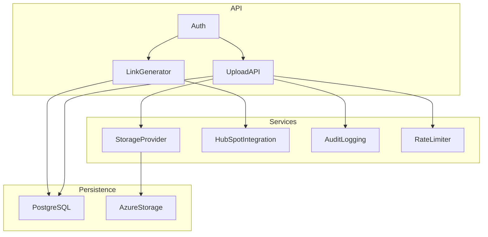
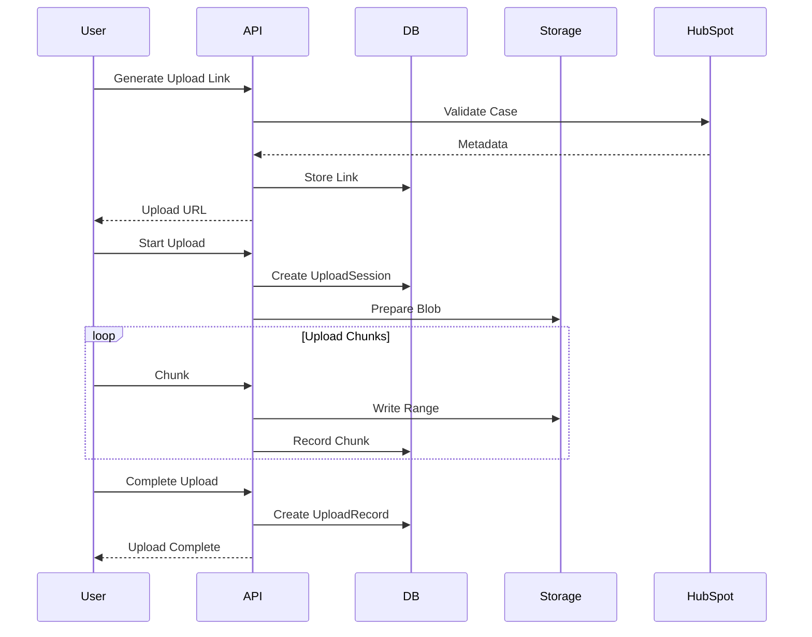
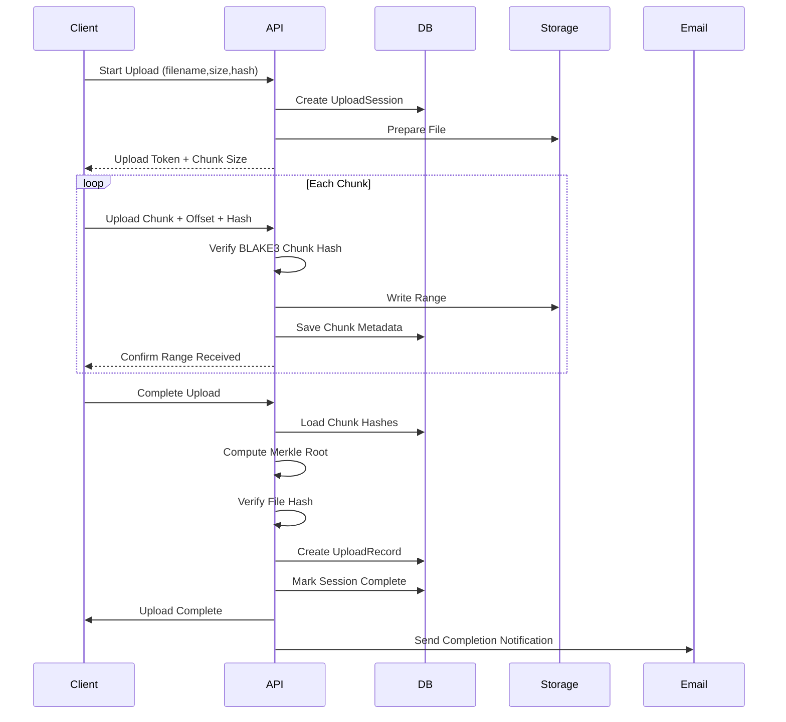
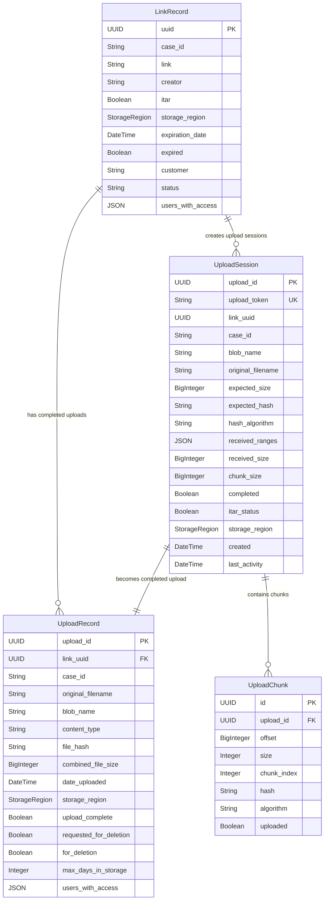
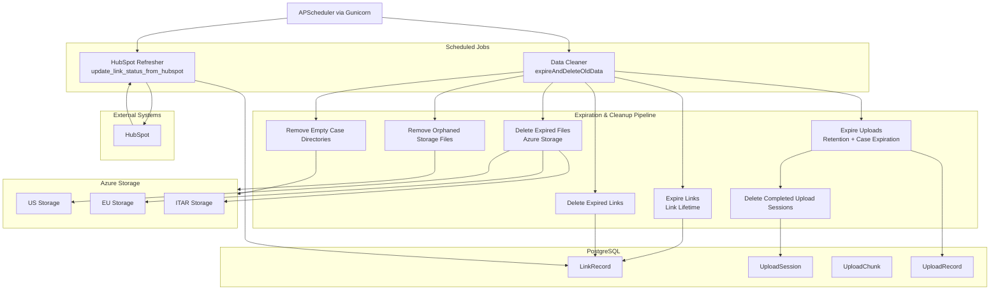
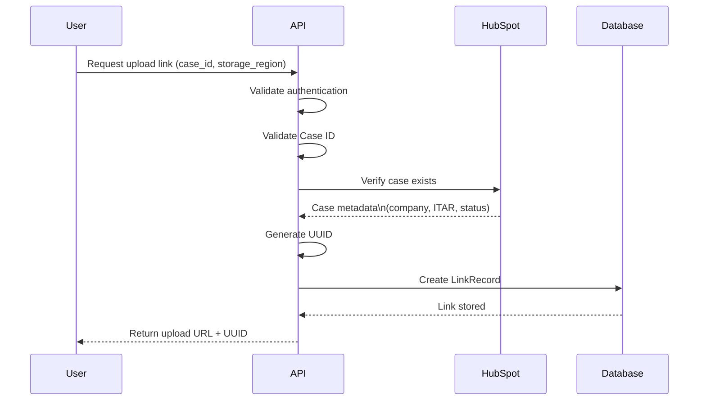
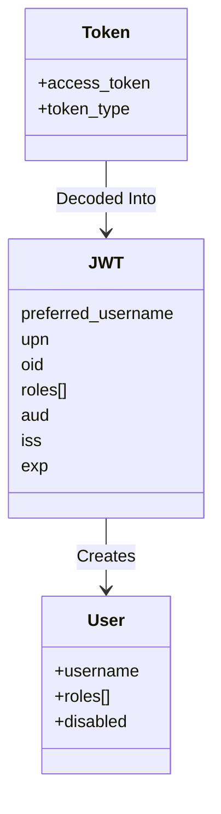
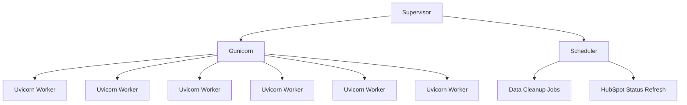

# Architecture diagrams
## Component architeture

## Request flow

## Upload lifecycle

## Database tables

## Scheduled Jobs

## Link generation sequence

## Authentication identity model

## Process diagram

