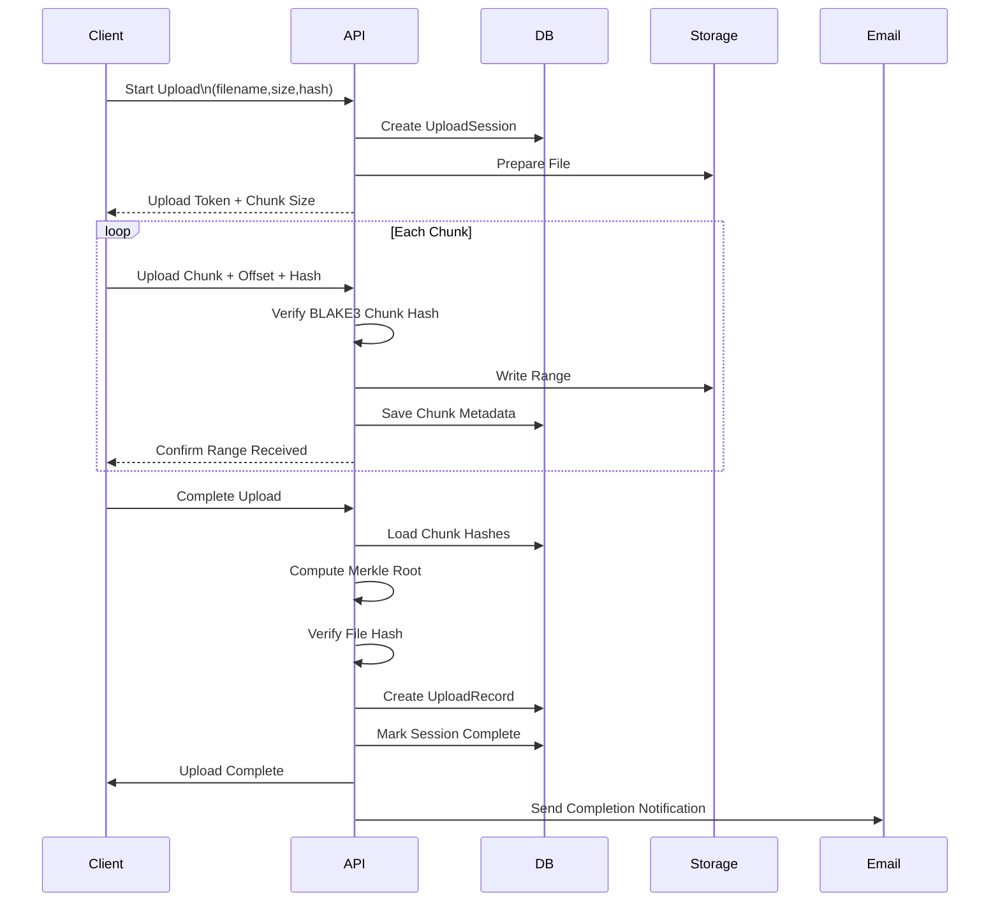

```mermaid
sequenceDiagram
    participant Client
    participant API
    participant DB
    participant Storage

    Client->>API: Start Upload\n(filename,size,hash)
    API->>DB: Create UploadSession
    API->>Storage: Prepare File
    API-->>Client: Upload Token + Chunk Size

    loop Each Chunk
        Client->>API: Upload Chunk + Offset + Hash
        API->>API: Verify BLAKE3 Chunk Hash
        API->>Storage: Write Range
        API->>DB: Save Chunk Metadata
        API-->>Client: Confirm Range Received
    end

    Client->>API: Complete Upload
    API->>DB: Load Chunk Hashes
    API->>API: Compute Merkle Root
    API->>API: Verify File Hash

    API->>DB: Create UploadRecord
    API->>DB: Mark Session Complete
    API->>Client: Upload Complete
    API->>Email: Send Completion Notification
```